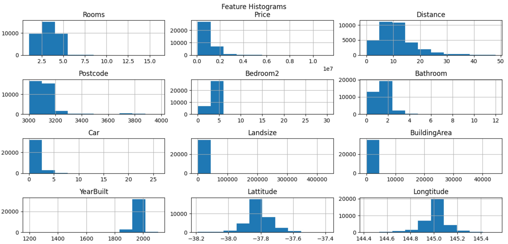

#Anomaly Detection

###Algorithm:
1. Choose a subset of features that might present unusual behavior.
2. Fit Gaussian parameters for each feature in the training set.
3. Given a new sample: compute its probability (according to the Gaussian parameters). If the probability is smaller than a threshold, epsilon, mark the sample as an anomaly.

####Evaluation
Classification accuracy is NOT a good way to measure the algorithm's performance because of skewed classes (so an algorithm that always predicts y = 0 will have high accuracy).
TP, FP, TN, FN, Precision, Recall or S-Score are better evaluation metrics.
Another way to evaluate the algorithm is to choose different values of epsilon, and then pick the value of epsilon that maximizes the f1 score.

###Anomaly Detection vs. Supervised Learning:
In anomaly detection, often the number of positive examples is low for a supervised learning algorithm. We use anomaly detection, and save the positive examples only for the cross validation and the test set.

##Implementation 
###A. Gaussian scores
1. Split the data to train, cross-validation and test. save all anomalies to CV, test.
2. Estimate parameters (mean and variance) for the Gaussian model on the training data.
3. For every sample compute its product of probability-density-functions over all the features. The low probability examples are more likely to be the anomalies in our dataset.
4. Find the best threshold (epsilon) using F-score in cross-validation.

###B. Isolation Forest
Describe the features histograms in the datasets:

The Isolation Forest returns the anomaly score of each sample. The IsolationForest 'isolates' observations by randomly selecting a feature and then randomly selecting a split value between the maximum and minimum values of the selected feature. The number of splittings required to isolate a sample is equivalent to the path length from the root node to the terminating node. This path length, averaged over a forest of such random trees, is a measure of normality. When a forest of random trees collectively produces shorter path lengths for particular samples, they are highly likely to be anomalies. We set 0 as the threshold value for outliers.

Sources: [kaggle](https://www.kaggle.com/kevinarvai/outlier-detection-practice-uni-multivariate),
[coursera](https://www.coursera.org/learn/machine-learning/programming/fyhXS/anomaly-detection-and-recommender-systems/instructions),
[towardsdatascience](https://towardsdatascience.com/andrew-ngs-machine-learning-course-in-python-anomaly-detection-1233d23dba95).
