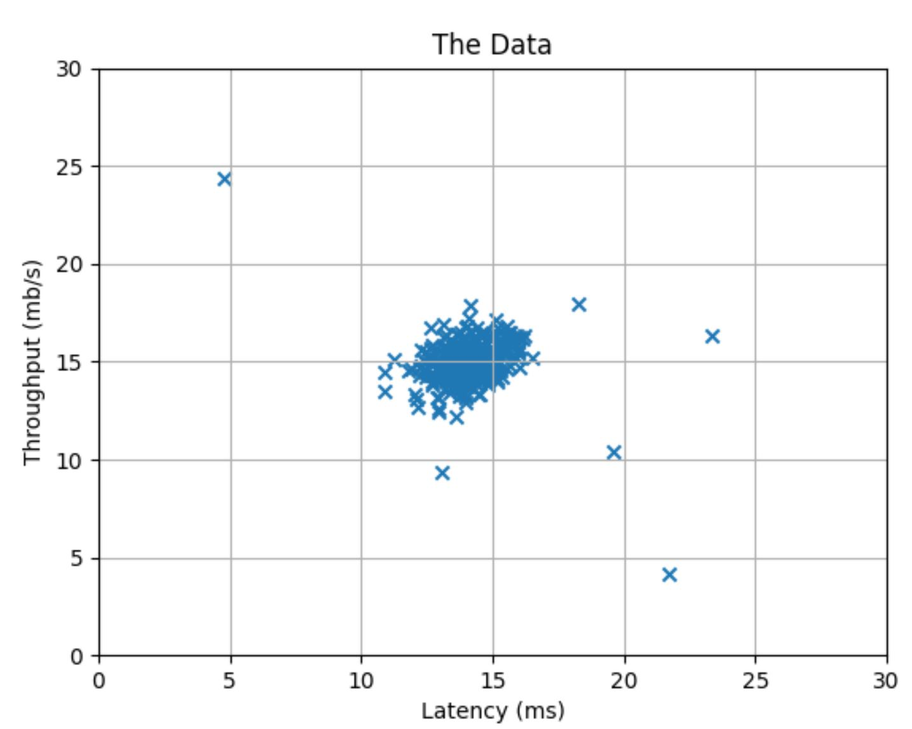
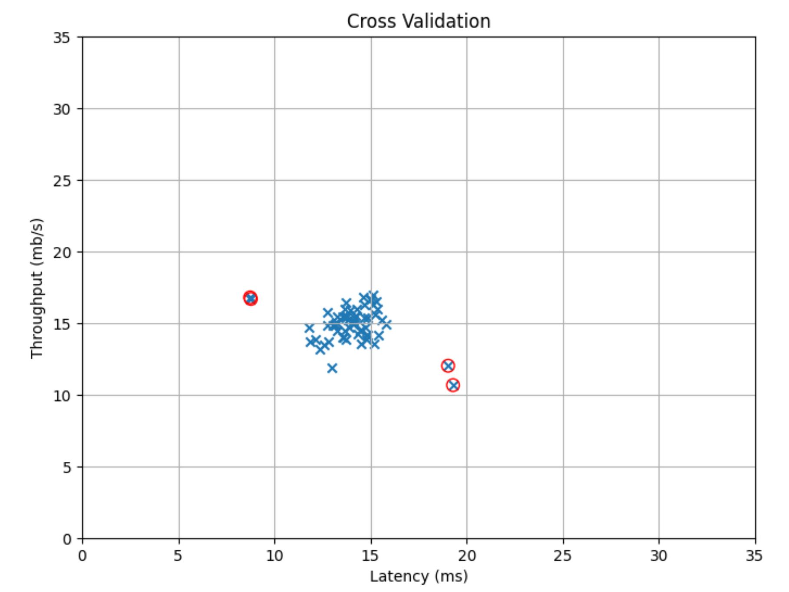
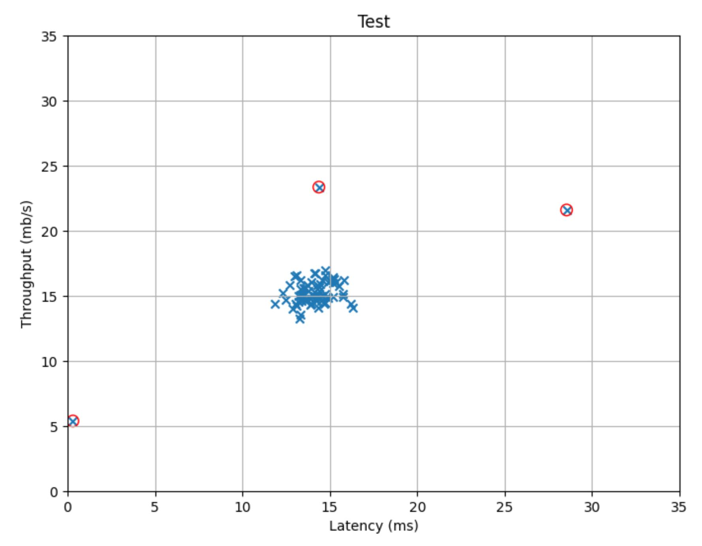
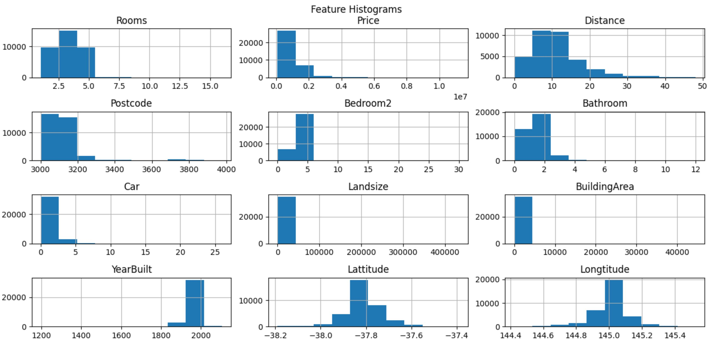
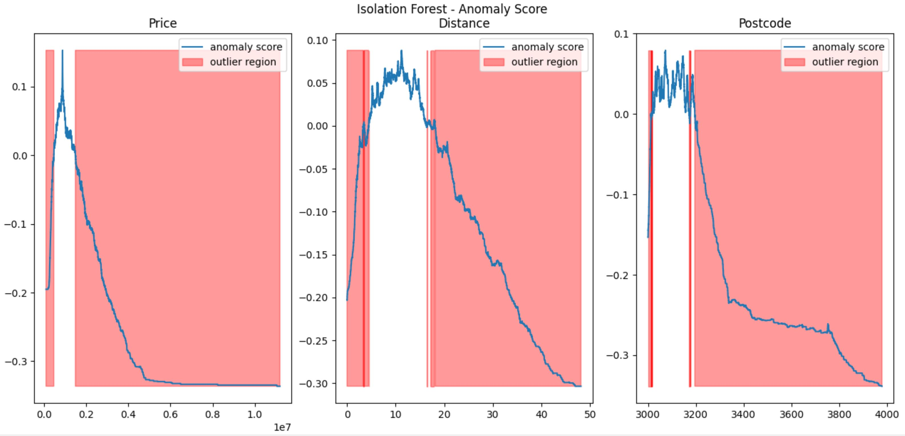

#Anomaly Detection

###Uses: 
Fraud, Manufacturing

###Algorithm:
1. Choose features X I, that you think might take on unusually low or high values and might describe unusually behavior.
2. Fit parameters: given a training set, of M, unlabeled examples, X1 through XM, we then fit the parameters, mu1 through mun, and sigma-squared1 through sigma-squared n.
3. Given a new example: compute the probability of this new example. If this probability is very small, then you flag this thing as an anomaly.

####Evaluation
Classification accuracy is NOT a good way to measure the algorithm's performance because of skewed classes (so an algorithm that always predicts y = 0 will have high accuracy).
TP, FP, TN, FN, Precision, Recall or S-Score are better evaluation metrics.
Another way to evaluate the algorithm is to choose different values of epsilon, and then pick the value of epsilon that, let's say, maximizes f1 score.

###Anomaly Detection vs. Supervised Learning:
In anomaly detection, often we have such a small number of positive examples that it is not possible for a learning algorithm to learn that much from the positive examples. So, we’ll use anomaly detection (and not Supervised Learning) and save the positive examples just for the cross validation set in the test set.

##Implementation 
###1. 
1. Split the data to train, cross-validation and test. save all anomalies to CV, test.
2. Estimate parameters (mean and variance) for the Gaussian model only on the training data.
3. For every sample compute its product of probability-density-functions over all the features. The low probability examples are more likely to be the anomalies in our dataset.
4. Fined the best threshold (epsilon) using F-score in cross-validation.

###2. Isolation Forest
Describe the features histograms in the datasets:

The Isolation Forest return the anomaly score of each sample. The IsolationForest 'isolates' observations by randomly selecting a feature and then randomly selecting a split value between the maximum and minimum values of the selected feature. The number of splittings required to isolate a sample is equivalent to the path length from the root node to the terminating node. This path length, averaged over a forest of such random trees, is a measure of normality. When a forest of random trees collectively produce shorter path lengths for particular samples, they are highly likely to be anomalies. We subtract self.offset_ to make 0 be the threshold value for being an outlier.

Sources: [kaggle](https://www.kaggle.com/kevinarvai/outlier-detection-practice-uni-multivariate),
[coursera](https://www.coursera.org/learn/machine-learning/programming/fyhXS/anomaly-detection-and-recommender-systems/instructions),
[towardsdatascience](https://towardsdatascience.com/andrew-ngs-machine-learning-course-in-python-anomaly-detection-1233d23dba95).