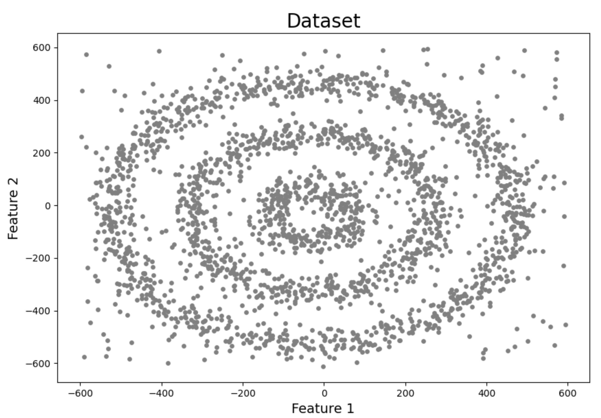
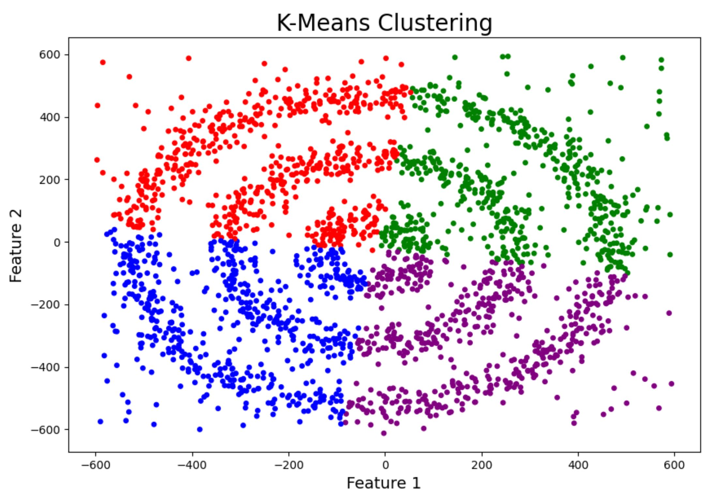
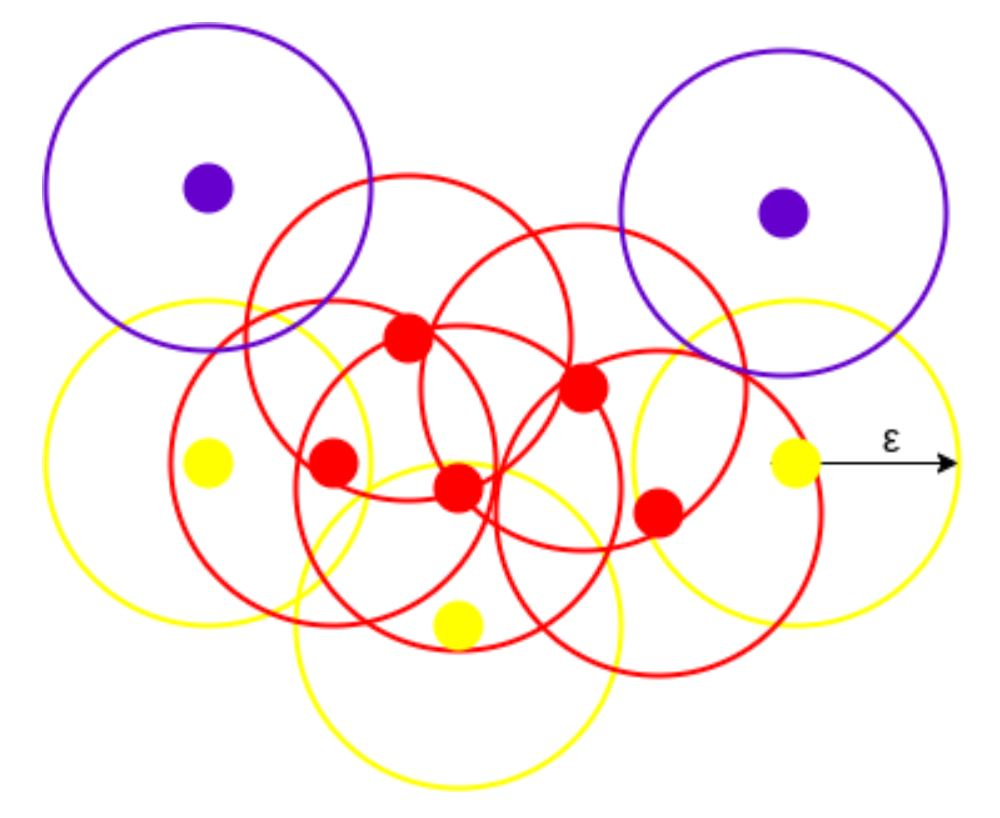
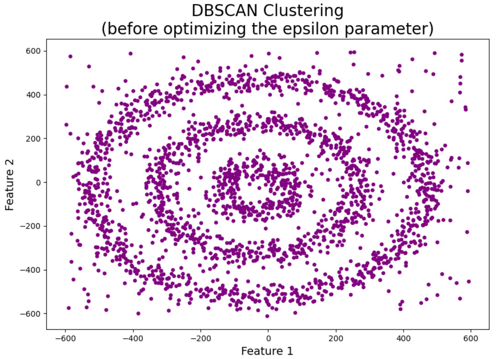
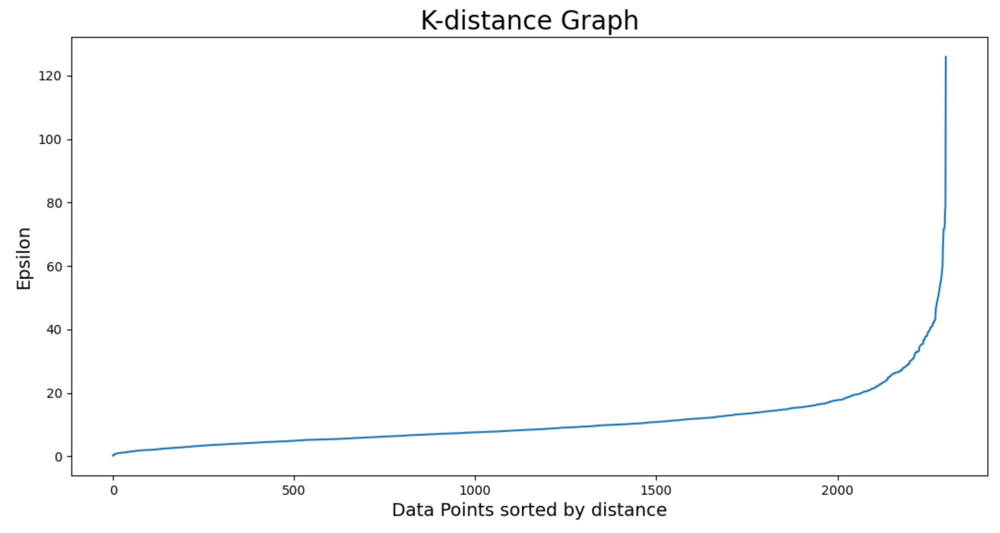
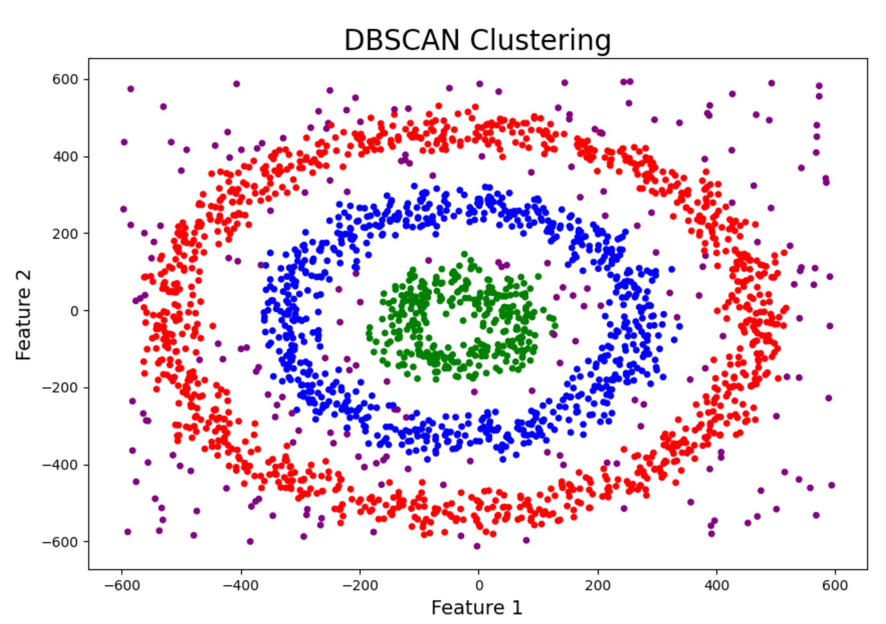

#DBSCAN clustering
##Motivation: 
K-Means and Hierarchical Clustering both fail in creating clusters of arbitrary shapes. 
They are not able to form clusters based on varying densities. That’s why we need DBSCAN clustering.

1. DBSCAN is not just able to cluster the data points correctly, but it also perfectly detects noise in the dataset.
2. DBSCAN is robust to outliers.
3. It does not require the number of clusters to be told beforehand.

DBSCAN is a density model. It searches the data space for areas of varied density of data points. It isolates various different density regions and assigns the data points within these regions to the same cluster.

##Implementation
###Algorithm:
It groups ‘densely grouped’ data points into a single cluster.
DBSCAN creates a circle of epsilon radius around every data point and classifies them into Core point, Border point, and Noise. 
1. Core point - if the circle around it contains at least ‘min-points’ number of points.
2. Border Point - if the number of points is less than ‘min-points’.
3. Noise - if there are no other data points around any data point within epsilon radius.

The figure shows us a cluster created by DBCAN with minPoints = 3

Before optimizing the epsilon all the data points are labeled as noise.

The value of epsilon can be chosen from the K-distance graph. The point of maximum curvature (elbow) in this graph tells us about the value of epsilon. 
If the value of epsilon is too small then a higher number of clusters will be created, and more data points will be taken as noise. If epsilon is too big then various small clusters will merge into a big cluster, and we will lose details.

The final result of the algorithm:

Sources:
[analyticsvidhya](https://www.analyticsvidhya.com/blog/2020/09/how-dbscan-clustering-works/),
[analyticsvidhya](https://www.analyticsvidhya.com/blog/2016/11/an-introduction-to-clustering-and-different-methods-of-clustering/).
