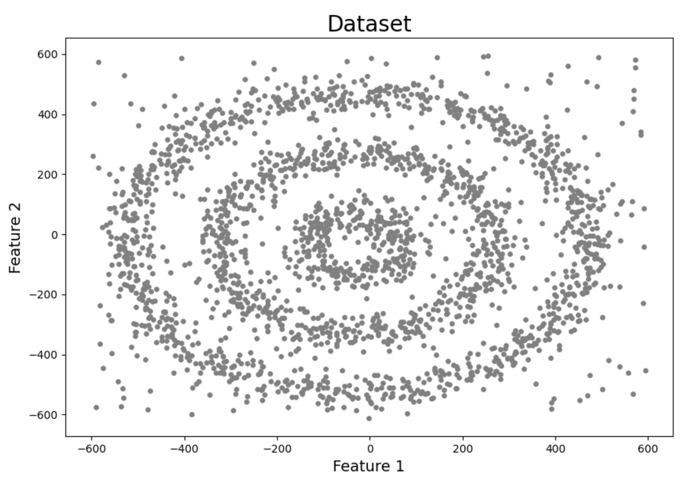
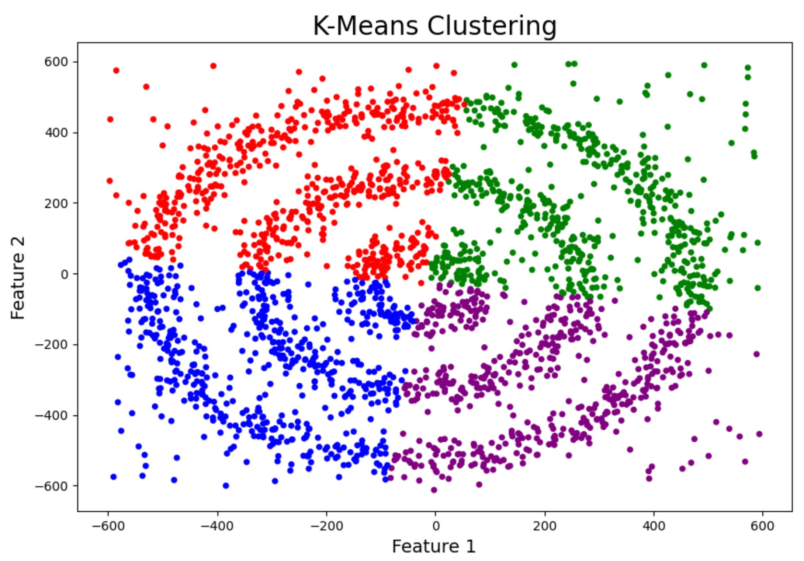
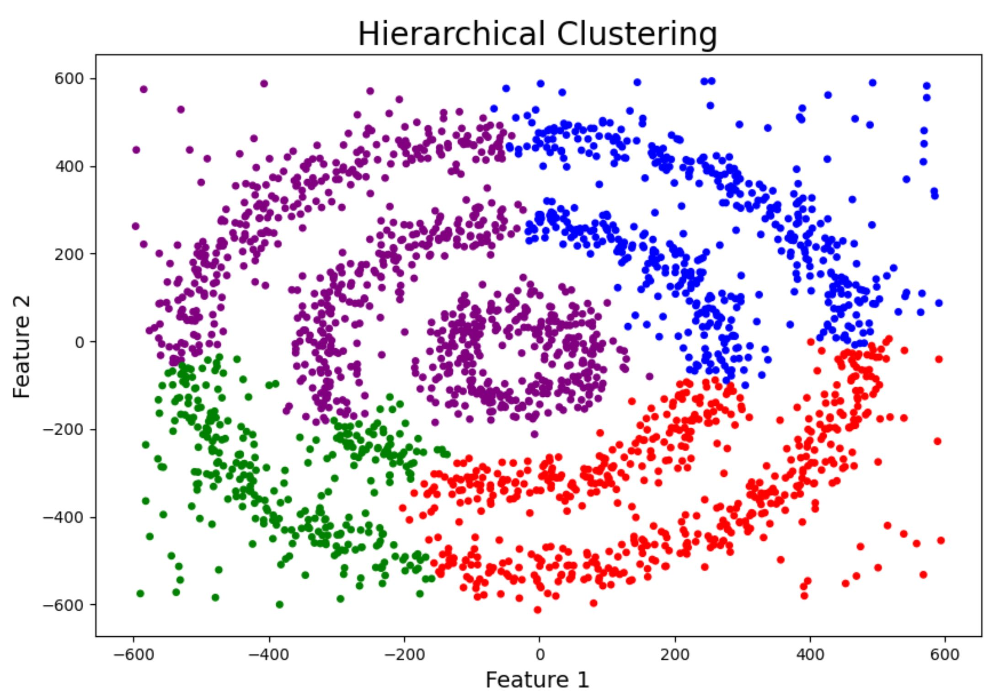
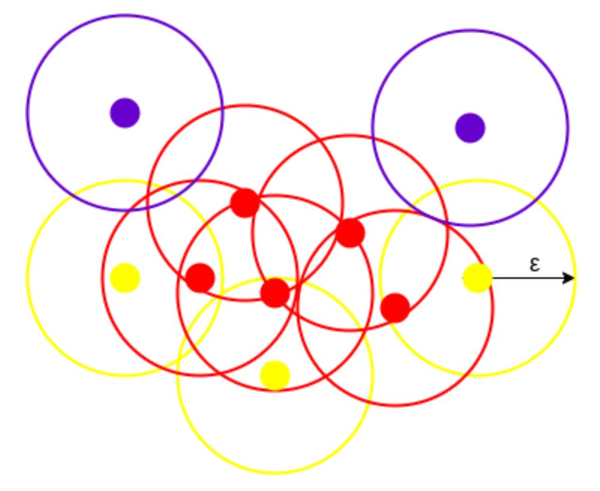
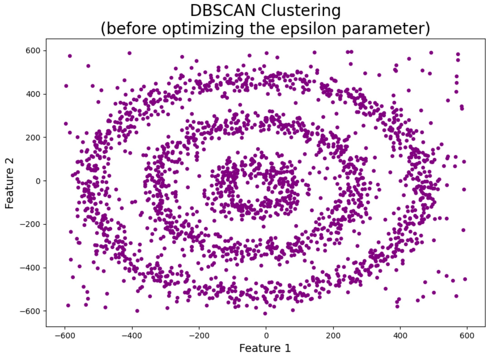
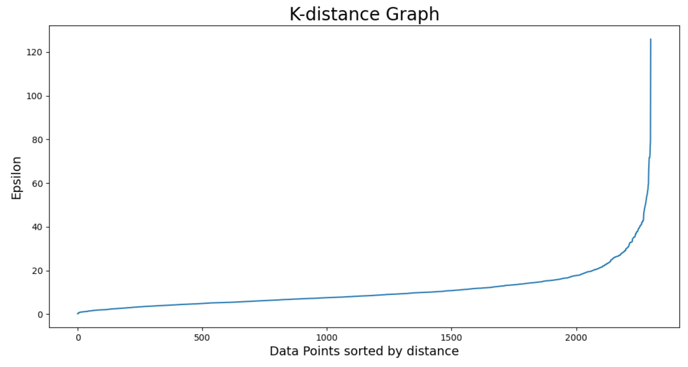
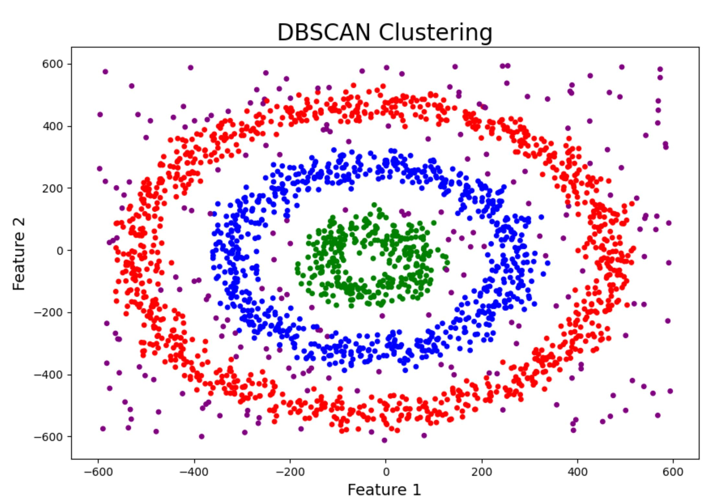

#DBSCAN clustering
##Motivation: 
K-Means and Hierarchical Clustering both fail in creating clusters of arbitrary shapes. 
They are not able to form clusters based on varying densities. That’s why we need DBSCAN clustering.

1. DBSCAN is not just able to cluster the data points correctly, but it also perfectly detects noise in the dataset.
2. DBSCAN is robust to outliers.
3. It does not require the number of clusters to be told beforehand.

DBSCAN is a density models. Density models search the data space for areas of varied density of data points in the 
data space. It isolates various different density regions and assign the data points within these regions in the same cluster.

##Implementation
DBSCAN creates a circle of epsilon radius around every data point and classifies them into Core point, Border point, and Noise. A data point is a Core point if the circle around it contains at least ‘minPoints’ number of points. If the number of points is less than minPoints, then it is classified as Border Point, and if there are no other data points around any data point within epsilon radius, then it treated as Noise.

Before optimizing the epsilon all the data points are labeled as noize.

The value of epsilon can be decided from the K-distance graph. The point of maximum curvature (elbow) in this graph tells us about the value of epsilon. 
If the value of epsilon chosen is too small then a higher number of clusters will be created, and more data points will be taken as noise. Whereas, if chosen too big then various small clusters will merge into a big cluster, and we will lose details.

The final result of the algorithm ability to cluster and label noise is impressive.

Sources:
[analyticsvidhya](https://www.analyticsvidhya.com/blog/2020/09/how-dbscan-clustering-works/),
[analyticsvidhya](https://www.analyticsvidhya.com/blog/2016/11/an-introduction-to-clustering-and-different-methods-of-clustering/).
