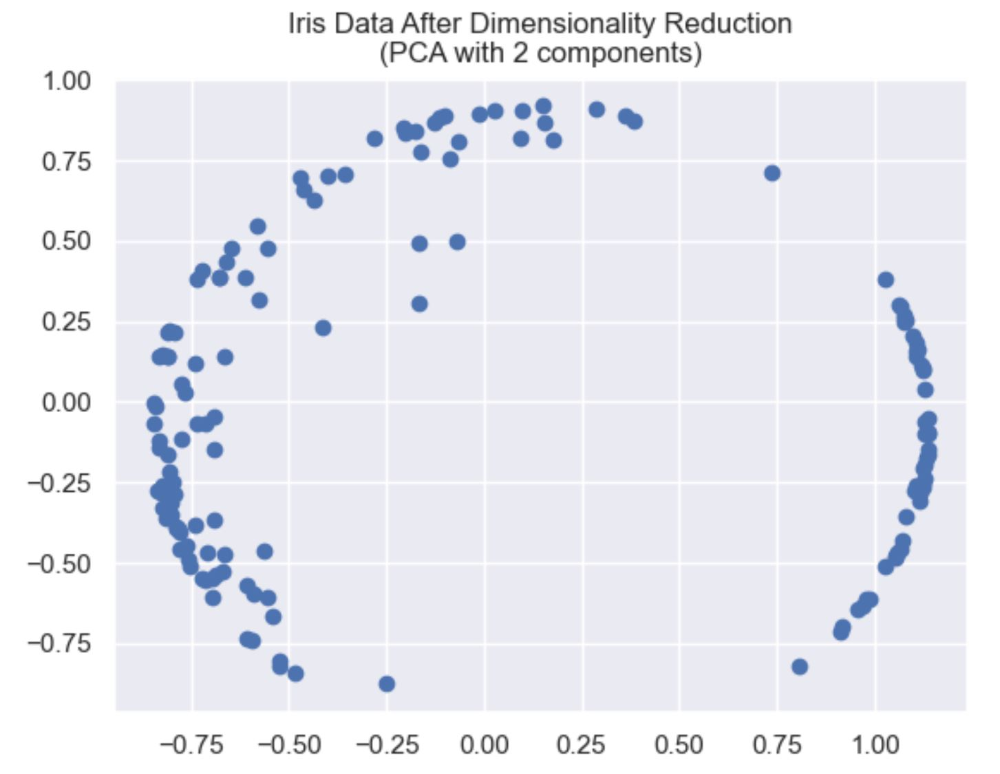
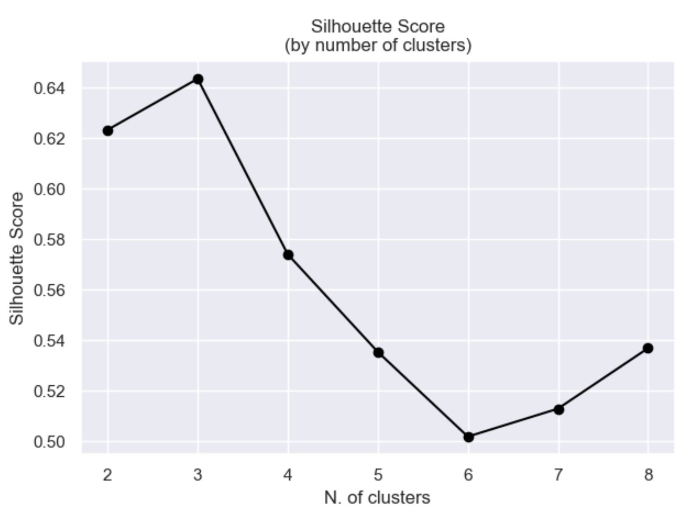
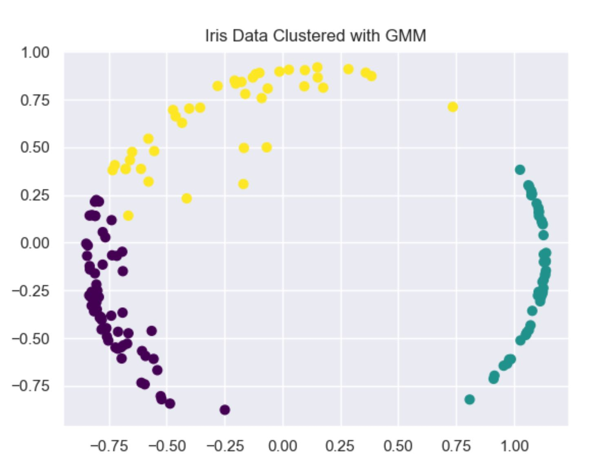
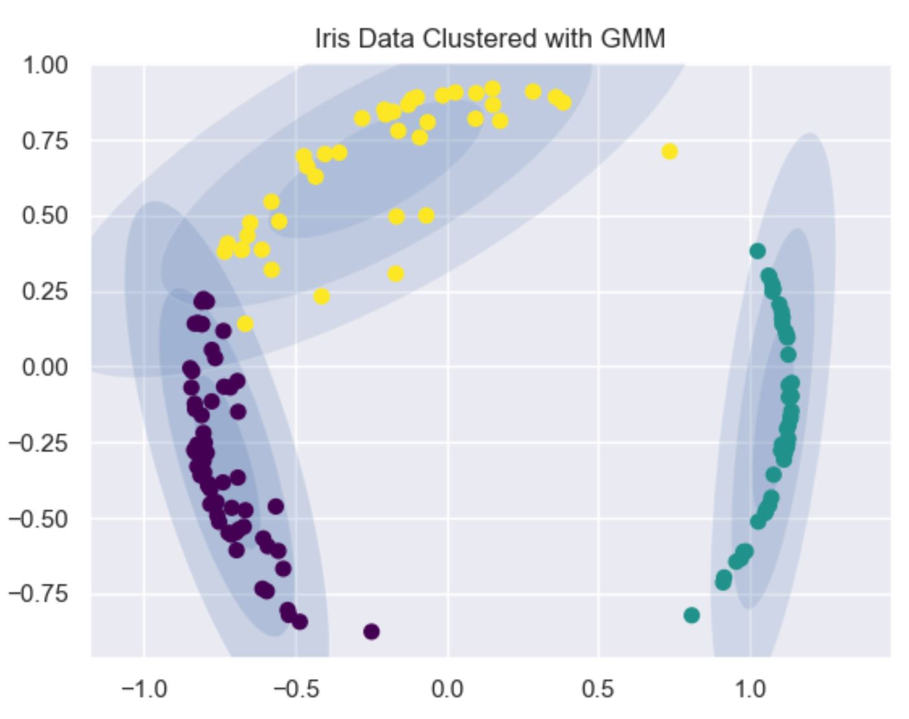

#Gaussian Mixture Model (GMM)

##Theory
A Gaussian mixture model involves the mixture of multiple Gaussian distributions. Rather than identifying clusters by “nearest” centroids (Kmeans), we fit a set of k gaussians to the data. Then we estimate gaussian distribution parameters such as mean and variance for each cluster and weight of a cluster. After learning the parameters for each sample, we calculate the probabilities of it belonging to each of the clusters. Every distribution is multiplied by a weight (π1+π2+π3=1) to account for the fact that we do not have an equal number of samples from each category.

##Implementation
I used a dataset that contains 4 features, reflecting the size and shape of leaves of the Iris flower (sepal length, 
sepal width, petal length and petal width). After standardizing, normalizing and reduction of the dimensions (PCA), 
the visualization is as follows:

The motivation is to figure out if the dataset contains different types of Iris, without knowing how 
many types there are. To select the best number of clusters I used 
[Silhouette score](https://scikit-learn.org/stable/modules/generated/sklearn.metrics.silhouette_score.html).
Silhouette score checks how much the clusters are compact and well separated. The Silhouette coefficient is calculated 
using the mean intra-cluster distance (a) and the mean nearest-cluster distance (b) for each sample. 
The Silhouette Coefficient for a sample is (b - a) / max(a, b). To clarify, b is the distance between a sample and the 
nearest cluster that the sample is not a part of. To create the figure, I ran a GMM model for each number of clusters 
and calculated the Silhouette score.

The closer the Silhouette score is to one, the better the clustering is. Therefore, we can see that 3 clusters fit the 
data best. I created a GMM model with 3 clusters and predicted the label of each sample. We can see that there are 
samples that are harder to label.

NOTE: it is possible to split the data to train and test and check if the normal distributions of each cluster are 
similar, using Jensen-Shannon (checks the similarity between two distributions. The lower the JS-distance is, the better 
the cluster is).

Sources: [towardsdatascience](https://towardsdatascience.com/gmm-gaussian-mixture-models-how-to-successfully-use-it-to-cluster-your-data-891dc8ac058f),
[kaggle](https://www.kaggle.com/vipulgandhi/gaussian-mixture-models-clustering-explained/notebook),
[PythonDataScienceHandbook](https://jakevdp.github.io/PythonDataScienceHandbook/05.12-gaussian-mixtures.html),
[wikipedia](https://en.wikipedia.org/wiki/Expectation%E2%80%93maximization_algorithm).
