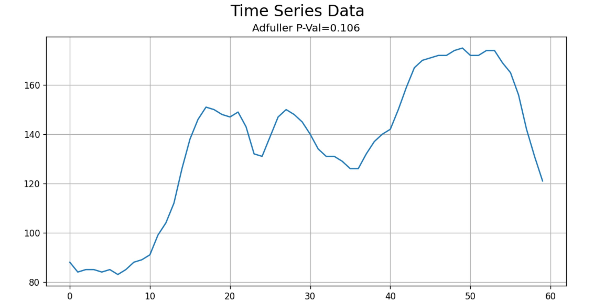
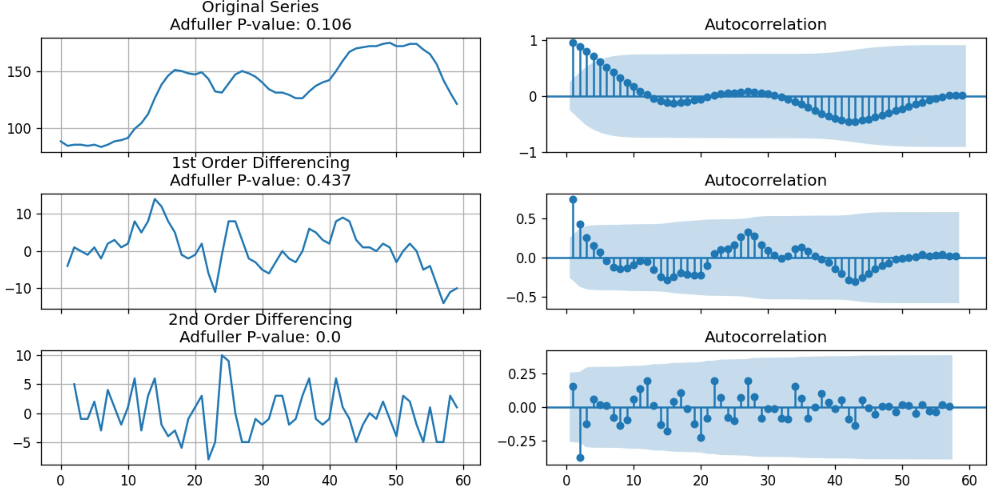
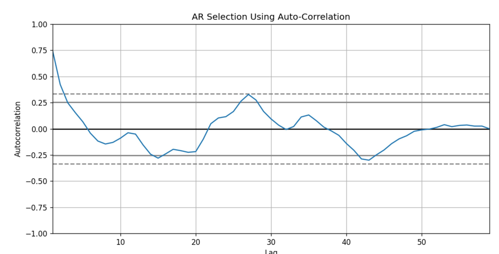
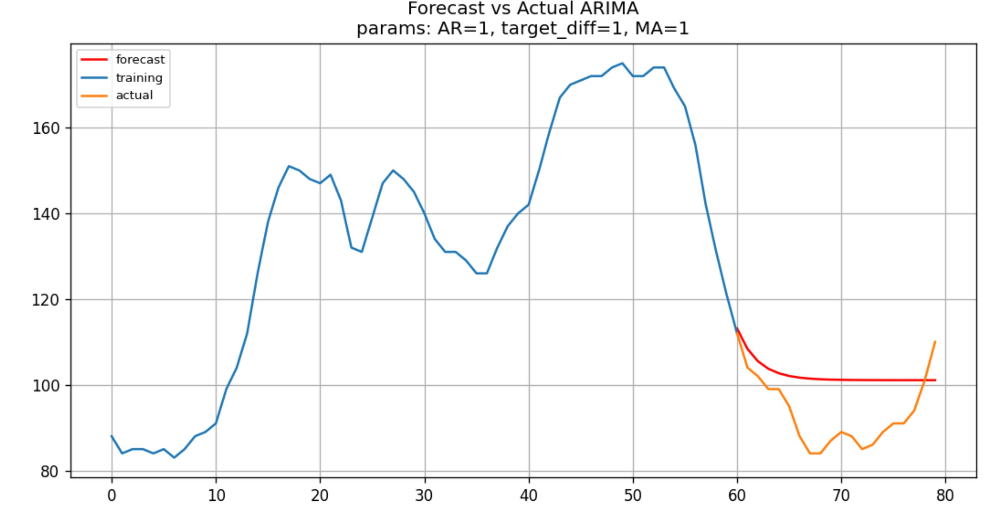
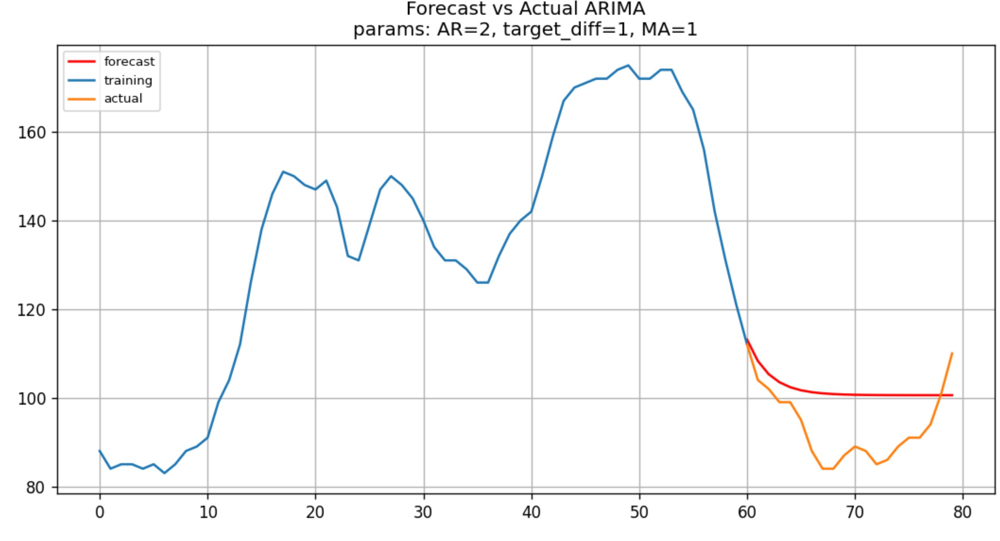
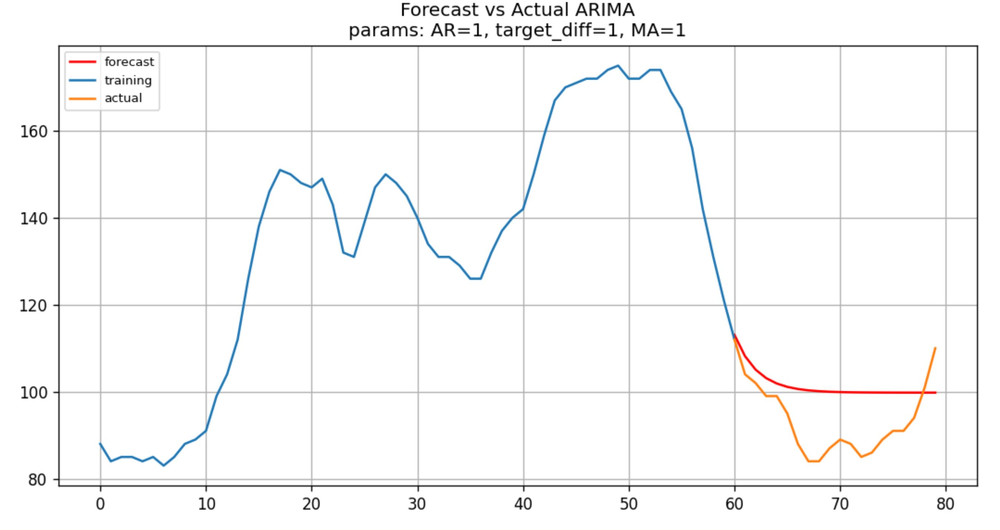
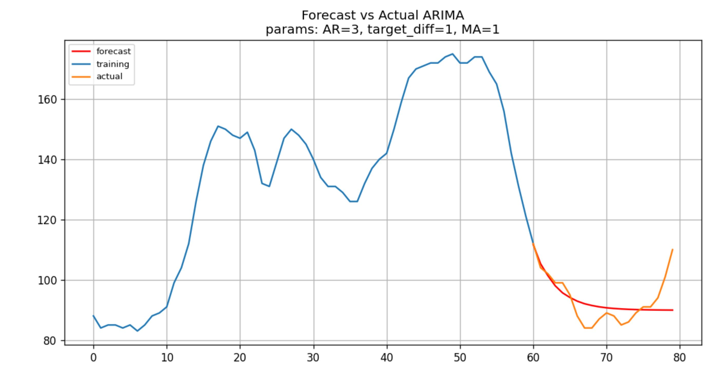
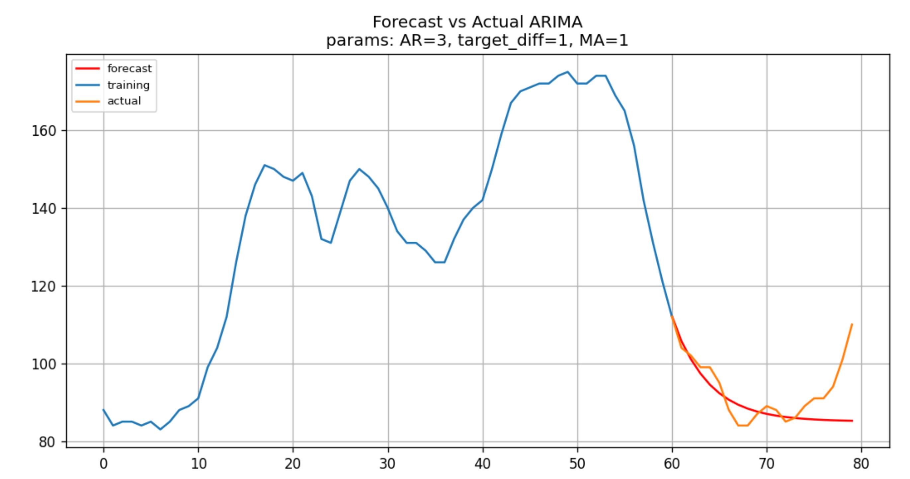
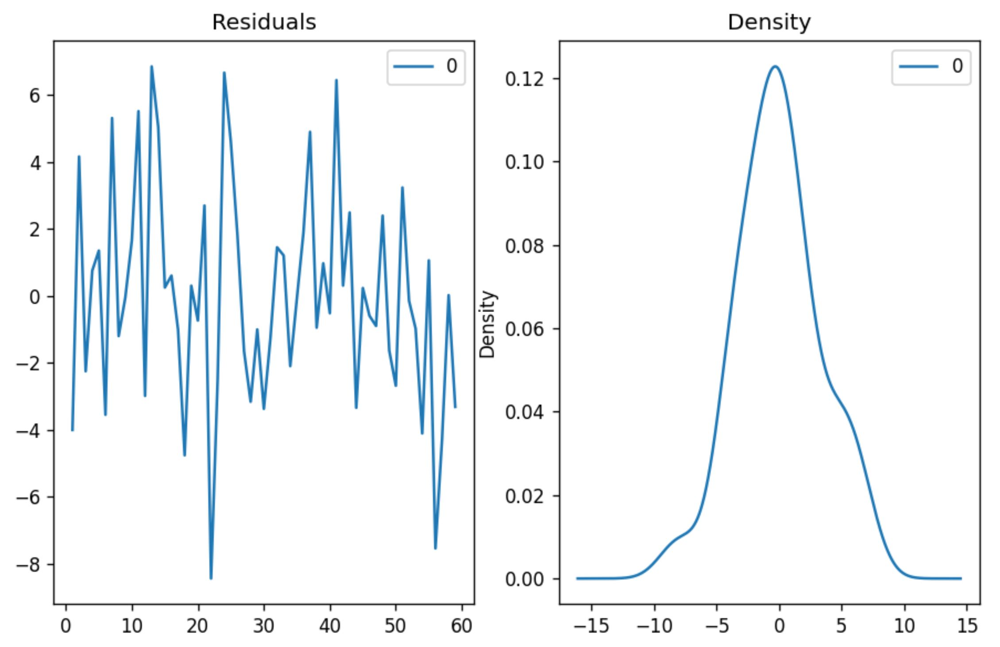

# ARIMA
ARIMA is a model that combines the Auto Regressive model (AR) - refers to the number of lags of Y to be used as 
predictors:  with Moving Avrage (MA) where Yt depends only on the lagged forecast errors 
 and stationary target (I).
The order of the AR and MA is based on the Auto Correlation Function (ACF) - the correlation between the observations at the current point in time and the observations at all previous points in time. 

## Implementation
I got a series with 100 samples. I split it to train (60%) validation (20%) and test.
My target series is non-stationary (I used adfuller test, P-val = 0.101).

To select the order of difference I plotted the first and second orders, checked the change in adfuller P-value and the Autocorrelations.
I chose the first order though it is not fully stationary, because the loss of information using the second order is very big. 

I chose the parameter of the AR using the Autocorrelation. The plot suggest that the 3 lags of the series significantly influence the current value. 
A similar method is used to select the MA parameter.

Using the validation, I tested a few options as parameter candidates for AR and MA using the significant option from the Autocorrelation plot.
The prediction is for all the validation period. 

The last model (AR=3, target-diff=1, MA=1) has the best fit to the validation period. Now it is possible to check the model on the test period.

Another recommended test is to plot the residuals to ensure that the mean is near zero and the variance is uniform.

Sources: [machinelearningplus](https://www.machinelearningplus.com/time-series/arima-model-time-series-forecasting-python/), 
[machinelearningmastery](https://machinelearningmastery.com/arima-for-time-series-forecasting-with-python/), 
[towardsdatascience](https://towardsdatascience.com/machine-learning-part-19-time-series-and-autoregressive-integrated-moving-average-model-arima-c1005347b0d7)

