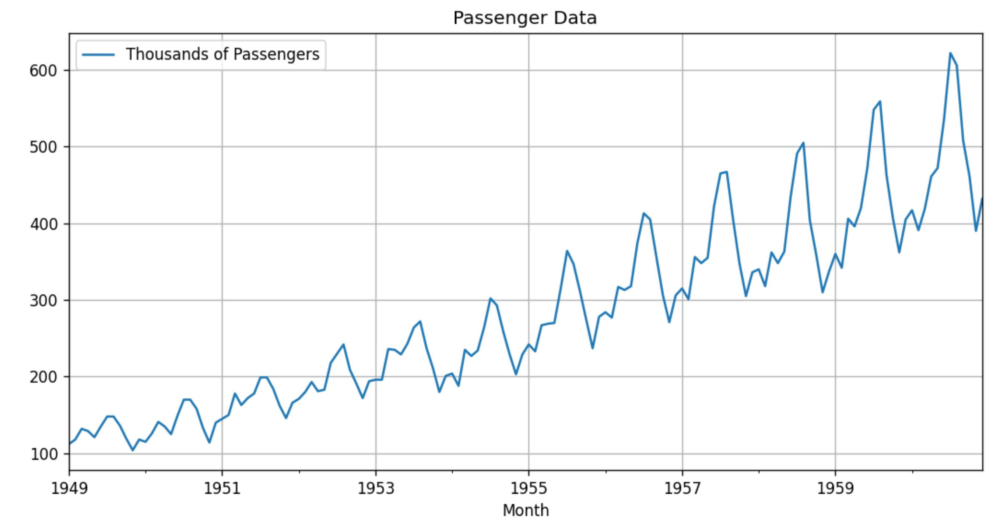
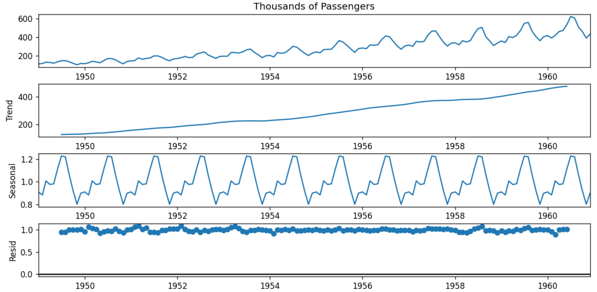
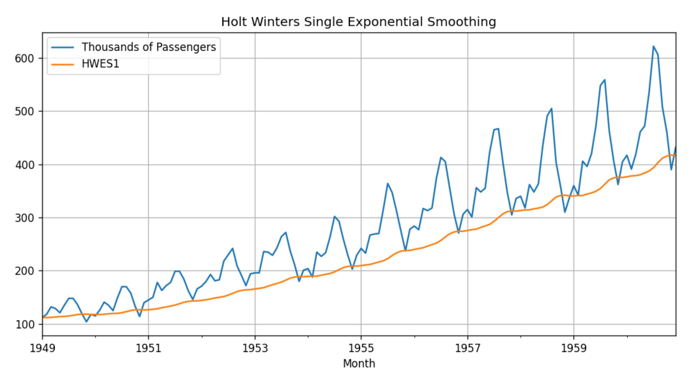
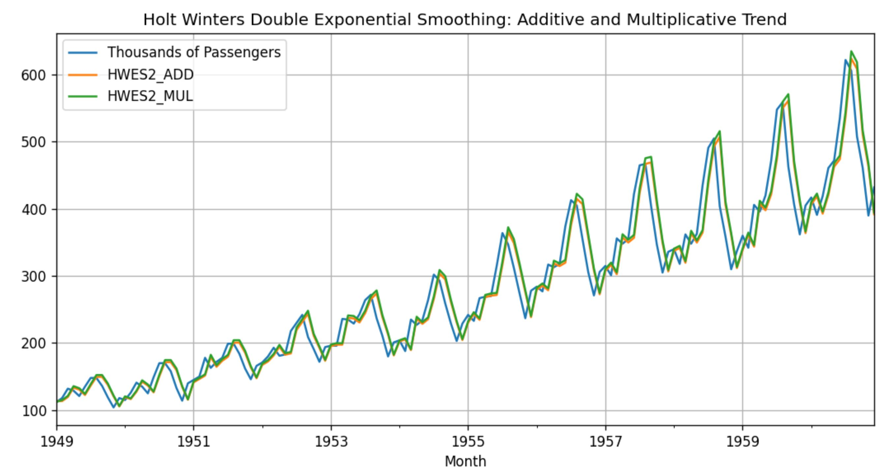
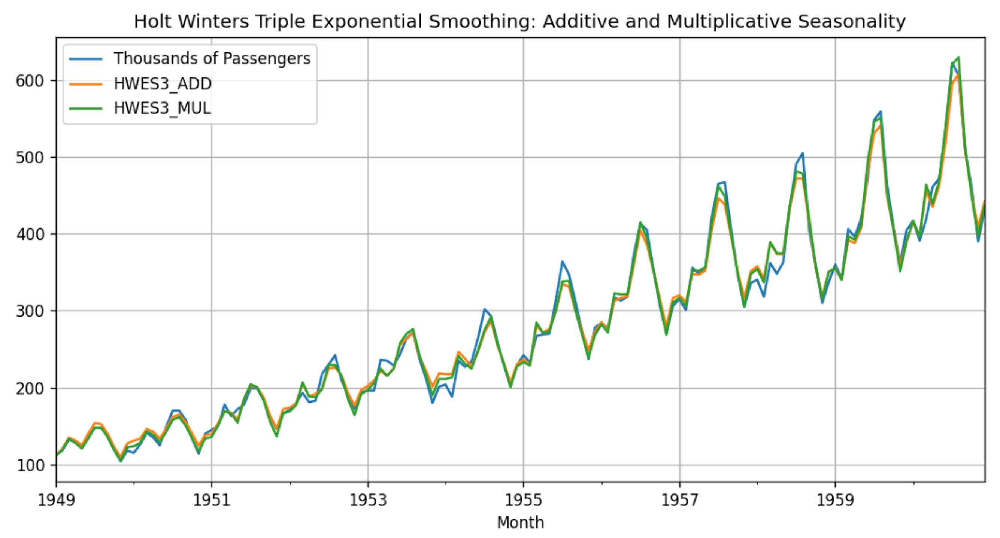
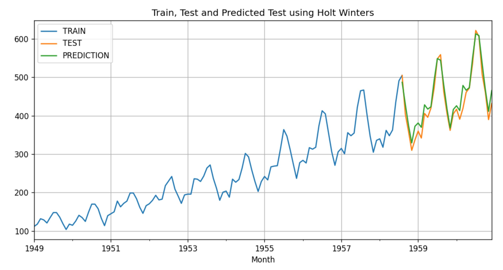
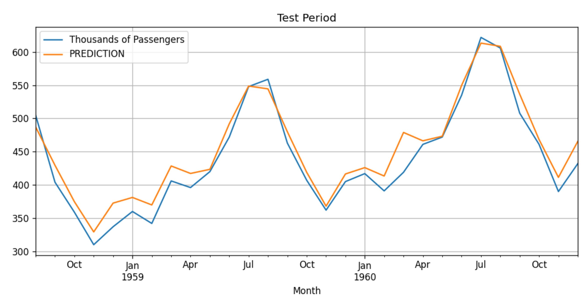

# Holt-Winters Exponential Smoothening (HWES)
Holt-Winters Exponential Smoothening (HWES) is a method that exponentially smooths time series data, by separating the data to 3 components, and exponentially smoothing each component separately. Single HWEL captures the series level, Double HWES considers data with trends and Triple HWES can even handle Seasonality.

## Disadvantages:
Holt-Winters forecasting cannot handle Time Series data with irregular patterns well.
HWES is a Univariate Forecasting technique and works with Stationary Time Series data.

## Implementation
The data I used includes monthly change in airline passengers since 1949.

Decomposition of the data ensure that in this case the time series has all 3 components: levels, trends, and seasonality.

Since I know the series has levels, trends, and seasonality I can immediately implement the triple HWEL, but I wanted to better understand the marginal addition of each layer. First I implemented the Single Exponential Smoothing:

As expected, it didn’t fit quite well, because single Exponential Smoothing doesn’t work for data with trends and Seasonality.

Double Exponential Smoothing:

The fit looks better, but since I know there is seasonality, I shall try the Triple Exponential Smoothing:

Forecasting:

Source: [medium](https://medium.com/analytics-vidhya/python-code-on-holt-winters-forecasting-3843808a9873),
[wiki](https://en.wikipedia.org/wiki/Exponential_smoothing#Triple_exponential_smoothing_(Holt_Winters))

